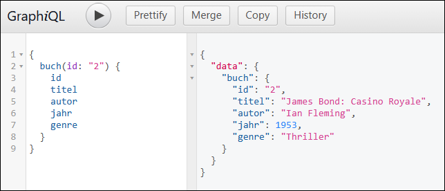

# GraphQL-API mit Nodejs für Bücher #

<br>

Dieses Repository enthält eine Nodejs-Anwendung mit Express.js, die eine GraphQL-API mit Daten zu Büchern
bereitstellt.

<br>

----

## Beispiel-Queries ##

<br>

Die folgenden Queries können in *GraphiQL* (Web-Client fuer GraphQL, erreichbar bei laufender Anwendung unter `/graphql`) eingegeben werden.

<br>



<br>

Alle Bücher zurückgeben, wobei nur die Felder `autor` und `titel` gefüllt sind:

```
{
  buecher {
    autor
    titel
  }
}
```

<br>

Alle Felder von Buch mit `ID=2` zurückgeben:

```
{
  buch(id: "2") {
    id
    titel
    autor
    jahr
    genre
  }
}
```

----

## License ##

<br>

See the [LICENSE file](LICENSE.md) for license rights and limitations (BSD 3-Clause License)
for the files in this repository.

<br>
